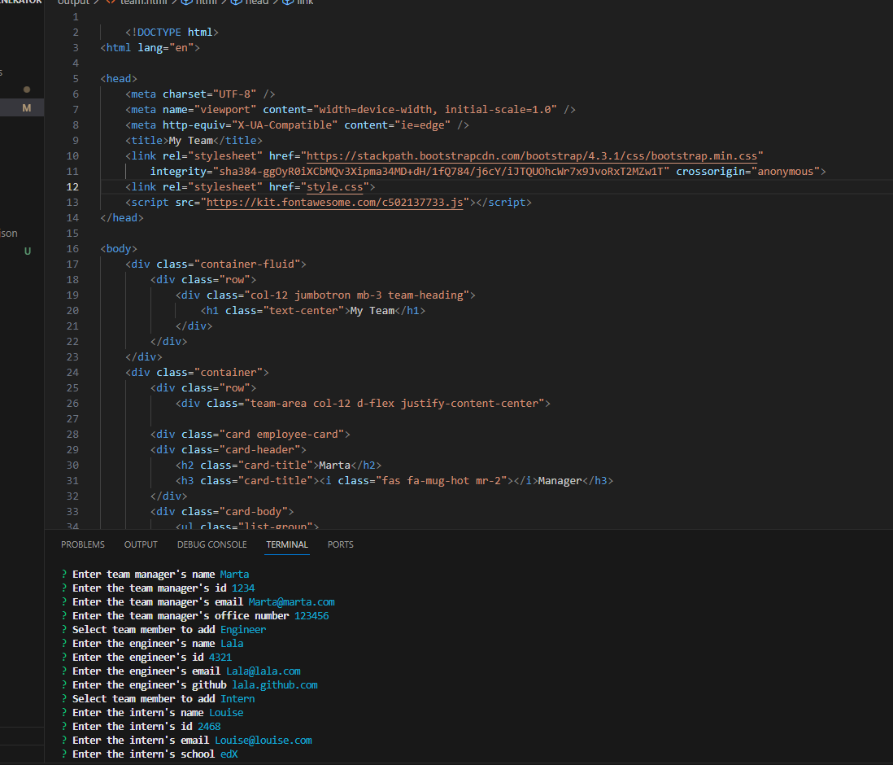

# Team-Profile-Generator

[Github Repo](https://github.com/Maeldeis/Team-Profile-Generator)

An application that generates HTML files using input from a command-line interface.

  - [Images](#images)
  - [Technologies](#technologies)
  - [License](#license)
  - [Contributing](#contributing)

## Images

## Technologies

- JavaScript
- [Node.js](https://nodejs.org/)
- NPM
- [Inquirer](https://www.npmjs.com/package//inquirer)
- [Jest](https://www.npmjs.com/package/jest)

## License

This application is covered under the MIT License.

## Contributing

For contributions, contact me [here](https://github.com/Maeldeis).